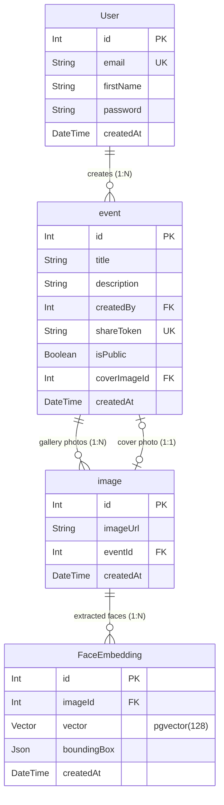

```mermaid
erDiagram
    User ||--o{ event : "creates (1:N)"
    event ||--o{ image : "gallery photos (1:N)"
    image |o--o| event : "cover photo (1:1)"
    image ||--o{ FaceEmbedding : "extracted faces (1:N)"

    User {
        Int id PK
        String email UK
        String firstName
        String password
        DateTime createdAt
    }

    event {
        Int id PK
        String title
        String description
        Int createdBy FK
        String shareToken UK
        Boolean isPublic
        Int coverImageId FK
        DateTime createdAt
    }

    image {
        Int id PK
        String imageUrl
        Int eventId FK
        DateTime createdAt
    }

    FaceEmbedding {
        Int id PK
        Int imageId FK
        Vector vector "pgvector(128)"
        Json boundingBox
        DateTime createdAt
    }
```
